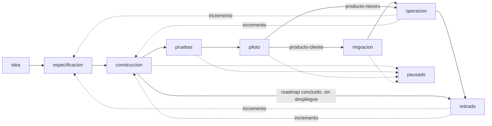

# Ciclo de vida de un producto Nexoru

Versión 1.2. Define los valores del campo `fase` del manifiesto y cuándo se pasa de uno a otro.

## Modelo

Todo producto se construye en el stack de Nexoru y se despliega primero en un subdominio de Nexoru (`despliegue: nexoru-subdominio`). Lo que pasa después depende del `tipo`:

- **`producto-cliente`**: al terminar el piloto, pasa por `migracion` al dominio y la infraestructura del cliente (`despliegue: dominio-cliente`), y después a `operacion`.
- **`producto-nexoru`**: se queda en la infraestructura de Nexoru y pasa de `piloto` a `operacion` sin `migracion`.
- **`interno`**: puede quedarse en `despliegue: local` o `ninguno`; `piloto` y `migracion` son opcionales.

`pausado` se puede alcanzar desde cualquier fase y regresa a la fase de la que salió. Agregar una fase nueva al roadmap de un proyecto en `operacion` o `retirado` lo regresa a `especificacion` o `construccion` (ver [Cierre y reactivación](#cierre-y-reactivación)). Cada cambio de `fase` actualiza `fase_desde`.

## Criterios por fase

| Fase | Criterios de entrada | Criterios de salida |
|---|---|---|
| `idea` | El Dueño registra el problema y para quién es. Existe `PROJECT.md` (puede tener `CONFIRMAR`). | Hay misión, alcance preliminar y decisión del Dueño de invertir en especificar. |
| `especificacion` | Decisión de avanzar. Repo en GitHub con Spec Kit inicializado. | Constitución en `.specify/memory/constitution.md`; al menos la primera fase del roadmap con `spec.md` y `plan.md`; mapa funcional con misión, componentes, flujo y reglas de negocio; `fecha_objetivo` definida. |
| `construccion` | Spec de la primera fase aprobada por el Dueño. CI y `.env.example` en el repo. | Todas las fases comprometidas para el lanzamiento están implementadas en la rama principal y desplegadas en el subdominio de Nexoru. |
| `pruebas` | Funcionalidad comprometida desplegada en el subdominio de Nexoru. | Criterios de aceptación de las specs verificados con pruebas reales y registrados en `## Evidencia de validación`. Ninguna fase del lanzamiento queda como `implementada-sin-validar`. |
| `piloto` | Pruebas completas. Usuarios reales definidos y costos mensuales en `## Costo mensual`. | Métricas de éxito medidas con uso real durante el periodo acordado y aceptadas por el Dueño (y por el cliente, en `producto-cliente`). |
| `migracion` | Solo `producto-cliente`. Piloto aceptado; dominio, cuentas e infraestructura del cliente disponibles. | Sistema corriendo en el dominio del cliente (`despliegue: dominio-cliente`, `urls` actualizadas); secretos rotados y en poder del cliente; datos migrados y verificados; el subdominio de Nexoru se da de baja o redirige. |
| `operacion` | Piloto aceptado (`producto-nexoru`) o migración completa (`producto-cliente`), con el roadmap concluido y el sistema desplegado. | No es final: sale a `pausado`, a `retirado`, o a `especificacion`/`construccion` al agregar una fase nueva al roadmap. |
| `pausado` | Decisión explícita del Dueño, con el motivo registrado en `## Riesgos, bloqueos y dependencias`. | Decisión del Dueño de reanudar, con nueva `fecha_objetivo`. |
| `retirado` | Una de dos: (a) el roadmap está concluido y el sistema no está desplegado; o (b) decisión explícita del Dueño de retirar un proyecto en `operacion` o `pausado`, con el motivo registrado en `## Decisiones clave`. En ambos casos: `despliegue: ninguno` sin `urls`, secretos de producción revocados y, en `producto-cliente`, entrega al cliente de sus datos y credenciales. | No es final: se reactiva al agregar una fase nueva al roadmap (ver abajo). |

## Relación con el roadmap

`fase` describe al **proyecto completo**; las fases del roadmap (`0`, `1`, `1.5`, ...) describen **entregas**. Un proyecto puede estar en `construccion` con varias entregas del roadmap ya completas y en uso real: p. ej., un proyecto cuyas primeras fases ya se usan en su subdominio mientras construye las siguientes.

## Cierre y reactivación

Las definiciones de fase concluida y roadmap concluido están en [roadmap.md](roadmap.md#fase-y-roadmap-concluidos).

**Cierre.** Con el roadmap concluido, el proyecto no se queda en `especificacion` ni en `construccion`:
- Si está desplegado (`despliegue` distinto de `ninguno`), su destino es `operacion`. Si todavía le faltan `pruebas`, `piloto` o `migracion`, pasa por ellas antes, con sus criterios de entrada y salida.
- Si no está desplegado, pasa a `retirado`.

**Reactivación.** Agregar una fase nueva al roadmap (un **incremento**) de un proyecto con el roadmap concluido (en `operacion`, `retirado` o en camino a `operacion`) obliga, en el mismo commit, a:
1. Cambiar `fase` a `especificacion` (si la fase nueva todavía no tiene `spec.md` y `plan.md`) o a `construccion` (si ya los tiene), con un `fase_desde` nuevo.
2. Definir `fecha_objetivo` para la fase nueva.
3. Actualizar `docs/mapa-funcional.md` con lo que agrega el incremento: componentes, flujo, reglas, datos y fuentes, e integraciones nuevos o modificados.
