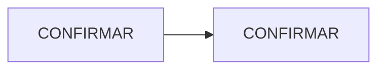

# CONFIRMAR: nombre del proyecto. Mapa de diseño funcional

> Resumen visual y funcional del sistema. El estado de avance vive en el roadmap de [PROJECT.md](../PROJECT.md); el detalle técnico exacto (requisitos, criterios de aceptación, tareas) en `specs/`. Si algo aquí no coincide con `specs/`, **`specs/` es la fuente de verdad**, salvo que el código y la documentación técnica coincidan entre sí y la spec sea la que quedó desactualizada.
>
> Este documento no lleva estados de avance (porcentajes, "completa", "pendiente", fechas objetivo).

## 1. Misión

CONFIRMAR: una frase y qué tipo de sistema es.

## 2. Componentes

| Componente | Función | Autonomía / responsable |
|---|---|---|
| CONFIRMAR | CONFIRMAR | CONFIRMAR |

## 3. Flujo

## 4. Reglas de negocio no negociables

- CONFIRMAR (autonomía, datos, dinero, seguridad)

## 5. Datos y fuentes

| Dato | Fuente | Disponibilidad | Confianza y regla |
|---|---|---|---|
| CONFIRMAR | CONFIRMAR | CONFIRMAR | CONFIRMAR |

## 6. Integraciones

| Servicio | Qué se consume | Variable de entorno | Límites y costo por uso |
|---|---|---|---|
| CONFIRMAR | CONFIRMAR | CONFIRMAR | CONFIRMAR |
